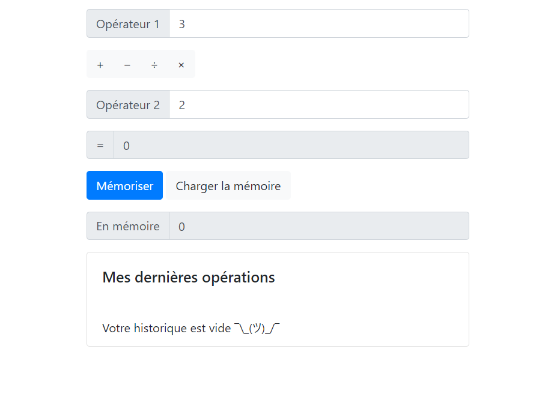

# TP1, calculator

You can find an online version of this repo here : https://calculette-angular.netlify.com

This project was generated with [Angular CLI](https://github.com/angular/angular-cli) version 9.0.5.

## Development server

Run `ng serve` for a dev server. Navigate to `http://localhost:4200/`. The app will automatically reload if you change any of the source files.

## Further help

To get more help on the Angular CLI use `ng help` or go check out the [Angular CLI README](https://github.com/angular/angular-cli/blob/master/README.md).
